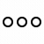

<h1 align="center">Зовите меня Константин
</h1>
<h3 align="center">Несколько лет назад – когда именно, неважно – я обнаружил JS</h3>

<h4> - Родился</h4>
<h4> - Программировал</h4>
<h4> - Помер</h4>

 

<h3 align="center">Ни одним из этих языков не владею, просто красивые иконки. Список может пополняться</h3>

<h3 align="center">А вот с этим уже можно поработать</h3>

 

<h4>:dollar: Готов работать за деньги(да)</h4>
<h4>:hamburger: Да и за еду</h4>
<h4>:yen: Да и за социальный рейтинг</h4>
<h4>:bulb: Да и за идею :relieved:</h4>

